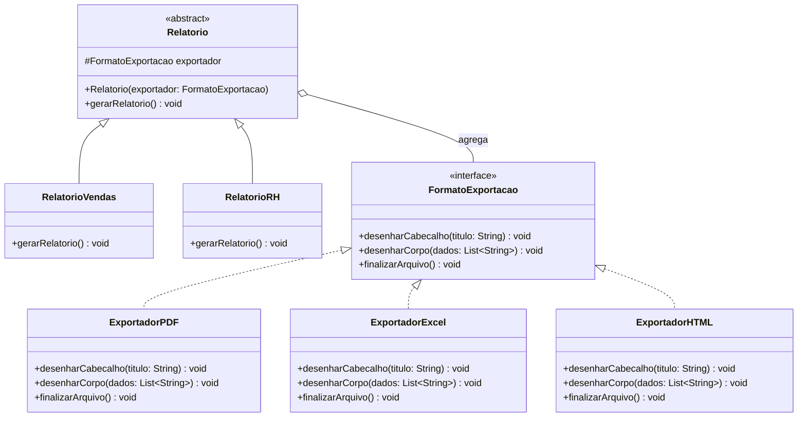
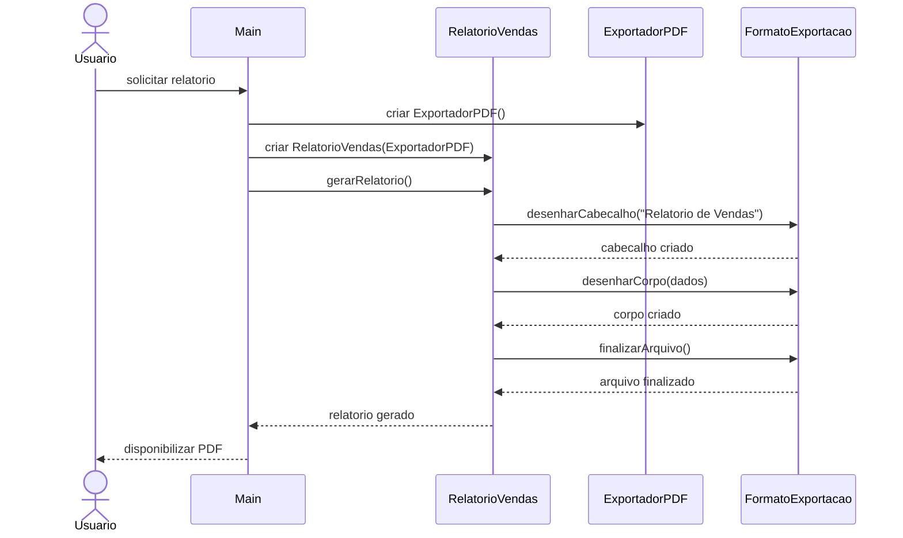
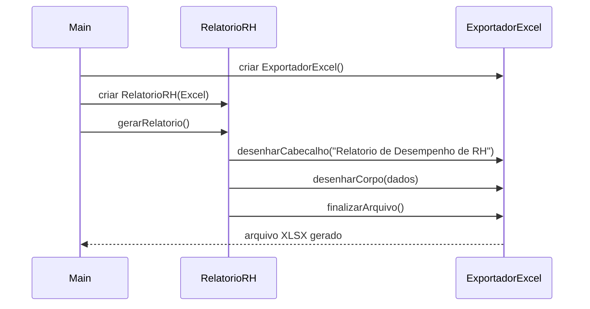

# TechFatec - Padrao Bridge para Relatorios

## Diagrama de Classes

```mermaid
classDiagram

    class Relatorio {
        <<abstract>>
        #FormatoExportacao exportador
        +Relatorio(exportador: FormatoExportacao)
        +gerarRelatorio() void
    }

    class RelatorioVendas {
        +gerarRelatorio() void
    }

    class RelatorioRH {
        +gerarRelatorio() void
    }

    class FormatoExportacao {
        <<interface>>
        +desenharCabecalho(titulo: String) void
        +desenharCorpo(dados: List~String~) void
        +finalizarArquivo() void
    }

    class ExportadorPDF {
        +desenharCabecalho(titulo: String) void
        +desenharCorpo(dados: List~String~) void
        +finalizarArquivo() void
    }

    class ExportadorExcel {
        +desenharCabecalho(titulo: String) void
        +desenharCorpo(dados: List~String~) void
        +finalizarArquivo() void
    }

    class ExportadorHTML {
        +desenharCabecalho(titulo: String) void
        +desenharCorpo(dados: List~String~) void
        +finalizarArquivo() void
    }

    Relatorio <|-- RelatorioVendas
    Relatorio <|-- RelatorioRH
    Relatorio o-- FormatoExportacao : agrega
    FormatoExportacao <|.. ExportadorPDF
    FormatoExportacao <|.. ExportadorExcel
    FormatoExportacao <|.. ExportadorHTML
```

## Diagrama de Sequencia

```mermaid
sequenceDiagram
    actor Usuario
    participant Main
    participant Relatorio as RelatorioVendas
    participant Exportador as ExportadorPDF
    participant Formato as FormatoExportacao

    Usuario->>Main: solicitar relatorio
    Main->>Exportador: criar ExportadorPDF()
    Main->>Relatorio: criar RelatorioVendas(ExportadorPDF)
    Main->>Relatorio: gerarRelatorio()
    Relatorio->>Formato: desenharCabecalho("Relatorio de Vendas")
    Formato-->>Relatorio: cabecalho criado
    Relatorio->>Formato: desenharCorpo(dados)
    Formato-->>Relatorio: corpo criado
    Relatorio->>Formato: finalizarArquivo()
    Formato-->>Relatorio: arquivo finalizado
    Relatorio-->>Main: relatorio gerado
    Main-->>Usuario: disponibilizar PDF
```

### Exemplo: Relatorio de RH em Excel

```mermaid
sequenceDiagram
    participant Main
    participant Relatorio as RelatorioRH
    participant Excel as ExportadorExcel

    Main->>Excel: criar ExportadorExcel()
    Main->>Relatorio: criar RelatorioRH(Excel)
    Main->>Relatorio: gerarRelatorio()
    Relatorio->>Excel: desenharCabecalho("Relatorio de Desempenho de RH")
    Relatorio->>Excel: desenharCorpo(dados)
    Relatorio->>Excel: finalizarArquivo()
    Excel-->>Main: arquivo XLSX gerado
```
