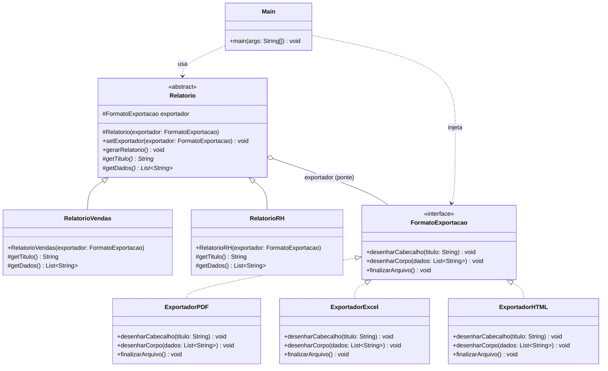
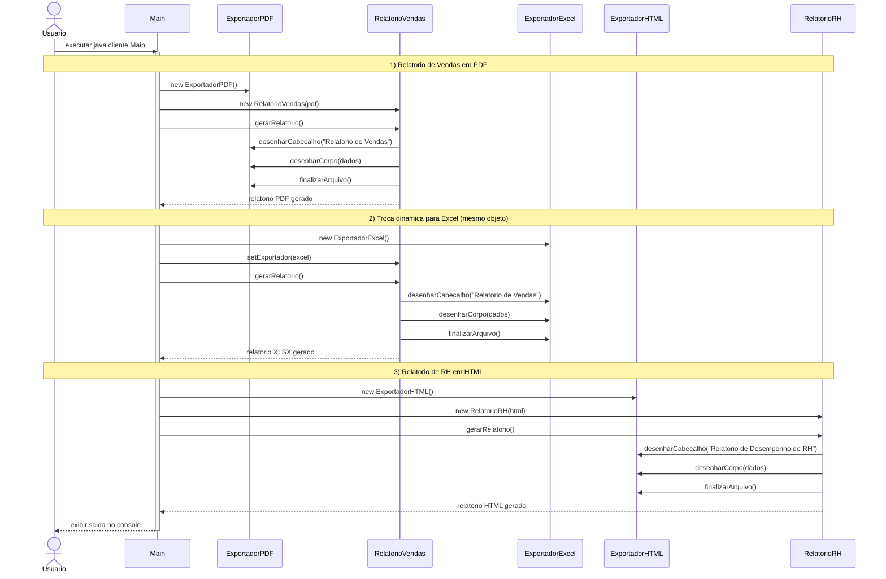

# TechFatec - Padrao Bridge para Relatorios

Modulo de relatorios do sistema de BI da TechFatec, reestruturado com o Padrao Bridge para permitir que
qualquer relatorio (Vendas, RH e futuros) seja exportado em qualquer formato (PDF, Excel/XLSX, HTML e futuros)
sem explosao de subclasses.

## O problema

O sistema legado gerava apenas o *Relatorio de Vendas* em *PDF*. Com heranca pura, cada combinacao
relatorio x formato viraria uma subclasse:

```
RelatorioVendasPDF, RelatorioVendasExcel, RelatorioVendasHTML,
RelatorioRHPDF,     RelatorioRHExcel,     RelatorioRHHTML, ...
```

Com `R` relatorios e `F` formatos teriamos `R x F` classes. Cada novo formato obrigaria a criar classes
em todos os relatorios.

## A solucao: Bridge

O Bridge separa duas hierarquias independentes ligadas por uma referencia (a "ponte"):

| Papel no padrao            | Classe                                         | Pacote            |
|----------------------------|------------------------------------------------|-------------------|
| Abstraction                | `Relatorio` (abstrata)                         | `src/abstracao`   |
| Refined Abstraction        | `RelatorioVendas`, `RelatorioRH`               | `src/abstracao`   |
| Implementor                | `FormatoExportacao` (interface)                | `src/implementacao` |
| Concrete Implementor       | `ExportadorPDF`, `ExportadorExcel`, `ExportadorHTML` | `src/implementacao` |
| Client                     | `Main`                                         | `src/cliente`     |

Agora temos `R + F` classes. O `Relatorio` define o que e gerado (titulo, dados e a ordem dos passos em
`gerarRelatorio()`); o `FormatoExportacao` define como cada passo e desenhado.

### Principio Aberto/Fechado (SOLID)

- **Novo formato** (ex.: CSV): basta criar `ExportadorCSV implements FormatoExportacao`. Nenhum relatorio muda.
- **Novo relatorio** (ex.: Financeiro): basta criar `RelatorioFinanceiro extends Relatorio`. Nenhum exportador muda.

O codigo existente fica **fechado para modificacao** e o sistema **aberto para extensao**.

### Injecao de Dependencia

As classes de relatorio **nunca** usam `new` para criar um exportador concreto. Elas dependem apenas da
interface `FormatoExportacao`, recebida pelo construtor:

```java
// src/abstracao/Relatorio.java
protected FormatoExportacao exportador;

protected Relatorio(FormatoExportacao exportador) {
    this.exportador = exportador;
}
```

Quem decide o formato concreto e o cliente (`Main`):

```java
Relatorio vendas = new RelatorioVendas(new ExportadorPDF());
```

Para a troca dinamica em tempo de execucao, `Relatorio` expoe `setExportador(FormatoExportacao)`,
que tambem recebe a dependencia de fora:

```java
vendas.setExportador(new ExportadorExcel());
vendas.gerarRelatorio(); // mesmo objeto, agora em XLSX
```

### Saida esperada

```
=== 1) Relatorio de Vendas em PDF ===
[PDF] %PDF-1.7 - Cabecalho: RELATORIO DE VENDAS
[PDF]   | Janeiro: R$ 120.000,00
[PDF]   | Fevereiro: R$ 98.500,00
[PDF]   | Marco: R$ 134.200,00
[PDF] %%EOF - arquivo relatorio.pdf gerado.

=== 2) Mesmo Relatorio de Vendas, trocado para Excel em tempo de execucao ===
[XLSX] Planilha criada | A1: Relatorio de Vendas
[XLSX] A2: Janeiro: R$ 120.000,00
[XLSX] A3: Fevereiro: R$ 98.500,00
[XLSX] A4: Marco: R$ 134.200,00
[XLSX] Pasta de trabalho salva - arquivo relatorio.xlsx gerado.

=== 3) Relatorio de RH em HTML ===
[HTML] <html><head><title>Relatorio de Desempenho de RH</title></head><body>
[HTML] <h1>Relatorio de Desempenho de RH</h1>
[HTML] <ul>
[HTML]   <li>Ana Souza - Nota 9,2 - Supera expectativas</li>
[HTML]   <li>Bruno Lima - Nota 7,8 - Atende expectativas</li>
[HTML]   <li>Carla Mendes - Nota 8,5 - Atende expectativas</li>
[HTML] </ul>
[HTML] </body></html> - arquivo relatorio.html gerado.
```

## Diagrama de Classes



## Diagrama de Sequencia


